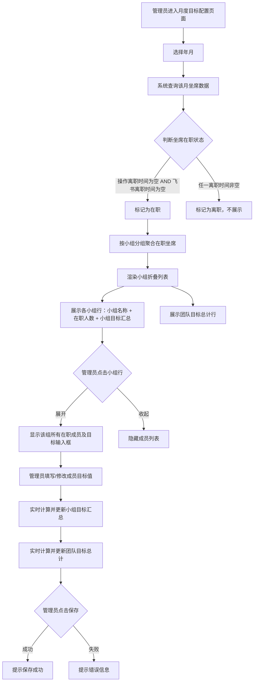

# 月度目标配置按小组展示 - PRD

## 一、修订记录

| 版本号 | 修改日期 | 修改原因 | 修订人 |
|--------|----------|----------|--------|
| v1.0 | 2026-03-11 | 初稿 | AI PRD Writer |

---

## 二、需求概述

### 2.1 背景/现状

当前电销CRM体验营系统中的**月度目标配置**页面（路径：配置 → 月度目标配置）以扁平列表形式展示所有坐席人员，存在以下痛点：

| 问题 | 描述 |
|------|------|
| 查找效率低 | 所有坐席人员以扁平列表展示（当前约130+人），无法按小组快速定位，管理者需逐一浏览查找 |
| 无汇总数据 | 没有小组级和团队级的目标汇总展示，管理者无法直观了解各小组和整体团队的目标总额 |
| 离职人员干扰 | 列表中包含已离职人员（标记为"离职"组），但不应在当月展示为可填写目标 |
| 目标单位不直观 | 当前目标填写单位为"万元"，与日常考核中按"元"结算的口径不一致，需频繁换算 |

### 2.2 需求目标

1. 将月度目标配置页面从**扁平列表**改为**按小组分组展示**，提升管理者查找和操作效率
2. 支持**点击小组展开/收起**，查看并填写小组成员的目标值
3. 每月仅展示**当月在职人员**数据，依据坐席管理-架构管理中的离职时间字段判定
4. 目标填写单位**从"万元"改为"元"**
5. 新增**小组目标汇总**和**团队目标总计**展示

### 2.3 核心逻辑简述

页面加载时，系统根据选定月份查询所有在职坐席（判定依据：坐席管理-架构管理中【操作离职时间】与【飞书离职时间】均为空），按所属小组进行分组聚合。页面以小组为维度展示可折叠的列表，每个小组行展示小组名称、在职人数和目标汇总金额。点击小组行可展开查看该组所有在职成员及其目标输入框，填写目标后实时计算小组汇总和团队总计。

---

## 三、术语表

| 术语 | 定义 |
|------|------|
| 月度目标 | 每月为每位坐席设定的销售业绩目标金额，单位为元 |
| 小组 | 坐席管理-架构管理中配置的组织架构层级，如"一组-遥遥领先"、"二组-李高俊子"等 |
| 在职人员 | 在坐席管理-架构管理中，【操作离职时间】和【飞书离职时间】两个字段均为空的坐席 |
| 操作离职时间 | 由管理员在CRM系统中手动操作设置的离职日期 |
| 飞书离职时间 | 从飞书系统同步过来的离职日期 |
| 小组目标汇总 | 一个小组内所有在职成员目标值之和 |
| 团队目标总计 | 所有小组目标汇总之和，即整个团队的月度目标总额 |

---

## 四、调整范围

| 模块 | 页面 | 调整类型 | 说明 |
|------|------|----------|------|
| 配置 | 月度目标配置 | 重构 | 将扁平人员列表改为按小组分组的折叠列表，目标单位从"万元"改为"元" |
| 配置 | 月度目标配置 | 新增 | 新增小组目标汇总行、团队目标总计行 |
| 配置 | 月度目标配置 | 优化 | 人员筛选逻辑优化，仅展示当月在职人员 |
| 坐席管理 | 架构管理 | 依赖 | 提供【操作离职时间】和【飞书离职时间】字段用于在职判定 |

---

## 五、业务流程图

---

## 六、可交互原型

在线预览：[点击查看可交互原型]（待部署后更新链接）

> 原型为可交互 HTML 页面，点击链接即可在浏览器中体验完整交互流程。

---

## 七、功能需求详细描述

### 7.1 页面整体布局

**页面路径**：体验营 → 配置 → 月度目标配置

| 功能按钮 | 功能说明 | 是否必填 | 功能类型 | 交互说明 | 备注 |
|----------|----------|----------|----------|----------|------|
| Tab切换 | 顶部Tab，当前为"客户管理" | - | Tab标签 | 点击切换不同业务线的目标配置 | 保持原有Tab结构不变 |
| 年月选择器 | 选择目标配置的月份 | 是 | 日期选择器（年-月） | 选择月份后页面刷新展示对应月份数据，默认当前月 | 仅可选择当前及之前月份 |
| 团队目标总计 | 展示整个团队所有小组的目标总和 | - | 只读文本 | 随成员目标值变化实时更新 | 显示在页面顶部区域，格式："团队目标总计：XXX 元" |
| 保存按钮 | 批量保存所有修改的目标值 | - | 按钮 | 点击后提交所有已修改的目标值到服务端 | 位于页面底部 |

### 7.2 小组列表（折叠视图）

小组列表是本次改造的核心交互区域，每个小组显示为一个可展开/收起的行。

#### 7.2.1 小组行（收起状态）

| 字段名称 | 字段说明 | 字段来源 | 备注 |
|----------|----------|----------|------|
| 展开/收起图标 | ▶（收起）/ ▼（展开）指示当前状态 | 前端状态 | 点击小组行任意位置可切换展开/收起 |
| 小组名称 | 坐席所属小组名称 | 坐席管理-架构管理 | 如"一组-遥遥领先"、"二组-李高俊子" |
| 在职人数 | 该小组当月在职成员数量 | 系统计算 | 格式："X 人" |
| 小组目标汇总 | 该小组所有成员目标值之和 | 系统实时计算 | 格式："小组目标：XXX 元"；随成员目标修改实时更新 |

#### 7.2.2 成员列表（展开状态）

点击小组行展开后，在该小组行下方展示成员列表：

| 字段名称 | 字段说明 | 字段来源 | 备注 |
|----------|----------|----------|------|
| 姓名 | 坐席姓名 | 坐席管理-架构管理 | 只读展示 |
| 目标（元） | 该成员的月度目标值 | 月度目标配置表 | 数字输入框，单位为元，默认值为 0，不可为负数 |
| 增减按钮 | 目标值的快捷加减操作 | 前端交互 | "+"/"-" 按钮，步长可配置（如按1000元递增/递减） |

### 7.3 在职人员判定规则

| 规则编号 | 规则描述 |
|----------|----------|
| R-001 | 从坐席管理-架构管理模块读取坐席的【操作离职时间】和【飞书离职时间】两个字段 |
| R-002 | **在职判定**：当且仅当【操作离职时间】为空 **并且** 【飞书离职时间】为空时，该坐席视为在职 |
| R-003 | **离职判定**：【操作离职时间】或【飞书离职时间】任一字段有值，即视为离职，不在该月目标配置中展示 |
| R-004 | 每次切换月份时重新执行在职判定查询 |
| R-005 | 如果某坐席在月中离职（飞书离职时间或操作离职时间在该月内），该月仍视为离职不展示 |

### 7.4 目标填写规则

| 规则编号 | 规则描述 |
|----------|----------|
| T-001 | 目标填写单位为**元**（原为万元），数据存储精度为整数 |
| T-002 | 目标值不允许为负数，最小值为 0 |
| T-003 | 目标值输入框仅允许输入数字 |
| T-004 | 修改目标值后，实时重新计算并展示该小组目标汇总和团队目标总计 |
| T-005 | 点击保存按钮后，批量提交所有已修改的目标值 |
| T-006 | 保存成功后弹出提示"保存成功" |
| T-007 | 保存失败提示具体错误原因 |

### 7.5 小组目标汇总与团队总计

| 功能按钮 | 功能说明 | 是否必填 | 功能类型 | 交互说明 | 备注 |
|----------|----------|----------|----------|----------|------|
| 小组目标汇总 | 每个小组行右侧显示该组所有成员目标之和 | - | 只读文本（实时计算） | 成员目标值变化时自动更新 | 格式："XXX 元" |
| 团队目标总计 | 页面顶部或底部固定位置展示团队总目标 | - | 只读文本（实时计算） | 任意成员目标值变化时自动更新 | 格式："团队目标总计：XXX 元"，字体加粗突出显示 |

### 7.6 数据迁移与兼容

| 规则编号 | 规则描述 |
|----------|----------|
| M-001 | 原有已保存的目标数据（单位为万元）需进行数据迁移，统一转换为元：原值 × 10000 |
| M-002 | 迁移过程中需做数据备份，确保可回滚 |
| M-003 | 前端显示和接口传参统一为元，后端存储也统一为元 |

### 7.7 交互状态说明

| 状态 | 触发条件 | 展示效果 |
|------|----------|----------|
| 初始加载 | 进入页面 | 所有小组默认收起，展示小组行汇总信息 |
| 展开小组 | 点击小组行 | 小组行图标变为 ▼，下方展开成员列表 |
| 收起小组 | 再次点击已展开的小组行 | 小组行图标变为 ▶，成员列表收起 |
| 目标编辑中 | 修改输入框数值 | 小组汇总和团队总计实时更新 |
| 保存中 | 点击保存按钮 | 按钮变为 loading 状态，禁止重复点击 |
| 保存成功 | 服务端返回成功 | Toast 提示"保存成功"，按钮恢复可点击 |
| 保存失败 | 服务端返回错误 | Toast 提示错误信息，按钮恢复可点击 |
| 无在职人员 | 某小组当月无在职人员 | 该小组不在列表中展示 |

---

## 八、埋点与数据需求

### 8.1 关键埋点事件

| 事件名称 | 触发时机 | 上报参数 | 用途 |
|----------|----------|----------|------|
| month_goal_page_view | 进入月度目标配置页面 | tab_name, selected_month | 统计页面访问量 |
| month_goal_group_toggle | 展开/收起小组 | group_name, action(expand/collapse) | 分析高频操作小组 |
| month_goal_edit | 修改成员目标值 | member_id, group_name, old_value, new_value | 追踪目标修改记录 |
| month_goal_save | 点击保存 | selected_month, modified_count, total_amount | 统计保存操作 |
| month_goal_save_result | 保存结果返回 | success/fail, error_msg | 监控保存成功率 |

### 8.2 数据指标

| 指标 | 说明 |
|------|------|
| 团队月度目标总额趋势 | 按月统计团队目标总额变化 |
| 各小组目标占比 | 各小组目标汇总占团队总目标的比例 |
| 目标配置完成率 | 已配置目标的坐席数 / 当月在职坐席数 |

---

## 九、权限说明

| 角色 | 查看页面 | 填写目标 | 保存目标 | 备注 |
|------|----------|----------|----------|------|
| 超级管理员 | ✅ | ✅ | ✅ | 可操作所有小组的目标 |
| 团队负责人 | ✅ | ✅ | ✅ | 可操作所管辖团队下所有小组的目标 |
| 小组组长 | ✅ | ✅ | ✅ | 仅可操作本小组成员的目标 |
| 普通坐席 | ❌ | ❌ | ❌ | 无权限访问目标配置页面 |

---

## 附录：当前页面小组分布（基于2026年3月数据）

以下为从当前页面抓取的小组及成员分布，供开发参考：

| 小组名称 | 当前成员（示例） |
|----------|------------------|
| 一组-遥遥领先 | 兰正红、牟为民、陈文栋、孙婧雪、胡明珠、周贯磊、兰英英、夏冰、陈斯武、郑国庆、阮长峰、罗宇环、邹建伟、熊逸凡、袁俊丽 |
| 二组-李高俊子 | 陈豪、周义柠、石满意、朱叶帅、綦玲、张文杨、胡男华、文婧、陈思源、汤晓军、杜俊锋、代艳、吴帆、龚刘明清、付祖发、李高俊子 |
| 三组-冯志辉（考核） | 冯志辉、吴其权、叶玉珠、涂婵、袁坤、刘莹、刘庆一、吴艳裘、林涛、李文浩、熊志超 |
| 四组-杨佐恒 | 刘文龙、罗冰钰、何双、张梦璇、胡光辉、朱强、杨晓慧、朱碧蓝、王闯、袁怀登、盛红兵、谢雪芹、李丹凤、顾双双、杨佐恒、朱巧会、罗智明、易杰、范飞宇、朱传念 |
| 五组-姚世帆 | 李永辉、刘凯、吴昶俊、孙蜀、袁宇科、潘辰、高友艳、姚世帆、李欢 |
| AI定时开课测试小组 | 洪涛、杨艳飞、涂思静、苏袁萍、李敏、夏蕾 |
| 长沙测试 | 徐啸林、廖彬、罗光润、李添、高凤伟、李伟、王澎江、余彦、邓英杰、王会晴、彭罗奇、孙悦、谭礼清 |
| 新兵营 | 金莹、黄冬阳、李刚路、施磊、熊梦迪、程梓鑫、盛雯、左攀、杨雪、刘珊、张心如、鲁紫曦、秦梓阔、黄莎、崔迪、沈进宝、孙泽鹏、魏长俊、刘金豪、余露、陈国栋、张成玉、李树林、柯小龙、李雪君、李书凝、江艾灵、陈梦琼、徐俊强、陈华佛、王适、宋鑫、许粤、杨昇桦、周天、徐述豪、江文、欧阳淑英、瞿忠财、陈志、罗琪、杨聪聪、方健、陶紫仪、滕宗兵、李宁、王利润、郑江风、张涵、裴雨婷、许可、易天成、冯裕贵、黄强、丁敏、毕健婷、吴庆峰、陈文、张洋、吴杰、陈天海、夏晴、刘路路、李洪涛、刘学勋、李天赐、陈成、焦成善、石炯、葛晖、焦莹莹、汤克追、张子龙、邹昂哲、郭贝贝、王晗、陈婉蝶、张钜腾、李书凝等 |
| 电销测试 | 肖振、曹原、石斐、方聪、赖永、杨帆、蒋攀、焦莹莹、丁燕、闫金洋、张鹏、汪林文 |
| 离职（不展示） | 覃肖、常丹、朱丽娟、邹书兵、金涛、程周、蒋瑞、李芳鸣、徐成宇 |
